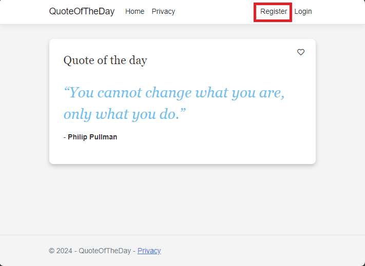
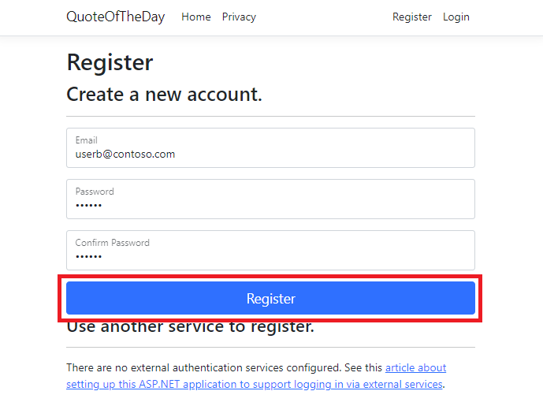
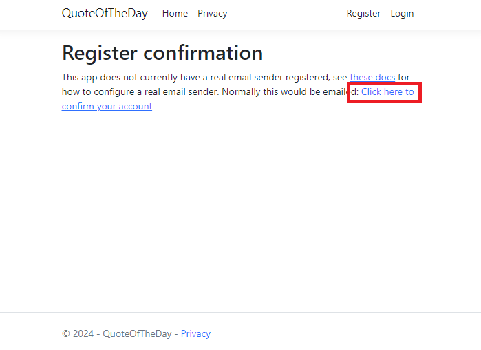
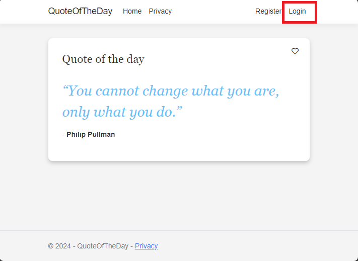
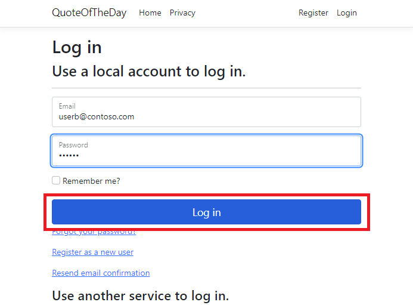

# QuickStart - Quote of the Day app for experimentation on Azure App Configuration

This QuickStart will allow you to create a basic application that shows how two categories of users view different messages alongside a quote of the day. 

## Prerequisites
- An Azure subscription. If you don’t have one, [create one for free](https://azure.microsoft.com/en-us/free/).<br />
- An App Configuration store. If you don’t have one, [create an App Configuration store](https://learn.microsoft.com/en-us/azure/azure-app-configuration/use-feature-flags-dotnet-core).<br />
    - A variant feature flag named "Greeting" inside the App Configuration instance
    - One variant named 'On' with value 'true'
    - One variant named 'Off' with value 'false'
    - Allocation between 'On' and 'Off' set to 50% / 50%
- An App Insights resource. If you don’t have one, [create an App Insights resource](https://learn.microsoft.com/en-us/azure/azure-monitor/app/create-workspace-resource?tabs=bicep).<br />


## Steps

1. In cmd run

`dotnet new razor --auth Individual -o QuoteOfTheDay`

This creates a new Razor Pages application in ASP.NET Core, using Individual account auth, and placing it in an output folder named "QuoteOfTheDay" 

2. In cmd, navigate to the `QuoteOfTheDay` folder and run

`dotnet user-secrets set ConnectionStrings:AppConfiguration "<App Configuration Connection string>"`

This creates a user secret (See [Secrets Management](https://learn.microsoft.com/en-us/aspnet/core/security/app-secrets?view=aspnetcore-8.0&tabs=windows)) for the application. This secret holds the connection string for App Configuration.

3. Next, run:

`dotnet user-secrets set ConnectionStrings:AppInsights "<App Insights Connection string>"`

This creates another user secret that holds the connection string for App Insights.

---

4. In QuoteOfTheDay.csproj add

```
<PackageReference Include="Microsoft.Azure.AppConfiguration.AspNetCore" Version="8.0.0-preview.2" />
<PackageReference Include="Microsoft.FeatureManagement.Telemetry.ApplicationInsights" Version="4.0.0-preview2" />
<PackageReference Include="Microsoft.FeatureManagement.Telemetry.ApplicationInsights.AspNetCore" Version="4.0.0-preview2" />
<PackageReference Include="Microsoft.FeatureManagement.AspNetCore" Version="4.0.0-preview2" />
```

This adds the latest preview versions of the Feature Management and App Configuration SDKs as required packages.

---

5. In `Program.cs` under the line `var builder = WebApplication.CreateBuilder(args);` add

```
builder.Configuration
    .AddAzureAppConfiguration(o =>
    {
        o.Connect(builder.Configuration.GetConnectionString("AppConfiguration"));

        o.UseFeatureFlags();
    });
```

This adds the App Configuration provider, which will pull down the configuration from Azure when the application starts. By default, the UseFeatureFlags method includes all Feature Flags with no label and sets a cache expiration time of 30 seconds.

---

6. In `Program.cs` add the following using statements:

```
using Microsoft.ApplicationInsights.AspNetCore.Extensions;
using Microsoft.ApplicationInsights.Extensibility;
using Microsoft.FeatureManagement.Telemetry.ApplicationInsights.AspNetCore;
```

Under where `builder.Configuration.AddAzureAppConfiguration` is called, add:

```
        // Add Application Insights telemetry.
        builder.Services.AddApplicationInsightsTelemetry(new ApplicationInsightsServiceOptions
            {
                ConnectionString = builder.Configuration.GetConnectionString("AppInsights")
            })
            .AddSingleton<ITelemetryInitializer, TargetingTelemetryInitializer>();
```

This adds Application Insights Telemetry Client to the application. It also includes a singleton TargetingTelemetryInitializer which appends Targeting information to each outgoing telemetry event

---

7. In the root folder (QuoteOfTheDay) create a new file named `ExampleTargetingContextAccessor.cs`. This will create a new class named `ExampleTargetingContextAccessor`. Paste the content below into the file.

```
using Microsoft.FeatureManagement.FeatureFilters;

namespace QuoteOfTheDay
{
    public class ExampleTargetingContextAccessor : ITargetingContextAccessor
    {
        private const string TargetingContextLookup = "ExampleTargetingContextAccessor.TargetingContext";
        private readonly IHttpContextAccessor _httpContextAccessor;

        public ExampleTargetingContextAccessor(IHttpContextAccessor httpContextAccessor)
        {
            _httpContextAccessor = httpContextAccessor ?? throw new ArgumentNullException(nameof(httpContextAccessor));
        }

        public ValueTask<TargetingContext> GetContextAsync()
        {
            HttpContext httpContext = _httpContextAccessor.HttpContext;
            if (httpContext.Items.TryGetValue(TargetingContextLookup, out object value))
            {
                return new ValueTask<TargetingContext>((TargetingContext)value);
            }
            List<string> groups = new List<string>();
            if (httpContext.User.Identity.Name != null)
            {
                groups.Add(httpContext.User.Identity.Name.Split("@", StringSplitOptions.None)[1]);
            }
            TargetingContext targetingContext = new TargetingContext
            {
                UserId = httpContext.User.Identity.Name,
                Groups = groups
            };
            httpContext.Items[TargetingContextLookup] = targetingContext;
            return new ValueTask<TargetingContext>(targetingContext);
        }
    }
}
```

This class declares how FeatureManagement's targeting gets the context for a user. In this case, it reads httpContext.User.Identity.Name for the UserId and treats the domain of the email address as a Group.

---

8. Navigate back to Program.cs and add the following using statements.

```
using Microsoft.FeatureManagement.Telemetry.ApplicationInsights;
using Microsoft.FeatureManagement;
using QuoteOfTheDay;
```

Then under where `AddApplicationInsightsTelemetry` was called, add

```
builder.Services.AddHttpContextAccessor();

// Add Azure App Configuration and feature management services to the container.
builder.Services.AddAzureAppConfiguration()
    .AddFeatureManagement()
    .WithTargeting<ExampleTargetingContextAccessor>()
    .AddTelemetryPublisher<ApplicationInsightsTelemetryPublisher>();
```

This adds services to handle App Configuartion Refresh, setup Feature Management, configure Feature Management Targeting, and enable Feature Management to publish telemetry events. 

---

9. Under the line `var app = builder.Build();` add

```
// Use Azure App Configuration middleware for dynamic configuration refresh.
app.UseAzureAppConfiguration();
```

This adds a middleware that triggers App Configuration refresh when appropriate

---

10. Under that add

```
// Add TargetingId to HttpContext for telemetry
app.UseMiddleware<TargetingHttpContextMiddleware>();
```

This enables the TargetingTelemetryInitializer to have access to Targeting information by storing it on HttpContext.

---

11. In QuoteOfTheDay > Pages > Shared > _Layout.cshtml under where 'QuoteOfTheDay.styles.css' is added, add the following line

```
<link rel="stylesheet" href="https://cdnjs.cloudflare.com/ajax/libs/font-awesome/5.15.3/css/all.min.css">
```

This adds the css for version 5.15.3 of font-awesome

---

12. Open QuoteOfTheDay > Pages > Index.cshtml.cs and overwrite the content to the quote app

```
using Microsoft.ApplicationInsights;
using Microsoft.AspNetCore.Mvc;
using Microsoft.AspNetCore.Mvc.RazorPages;
using Microsoft.FeatureManagement;

namespace QuoteOfTheDay.Pages;

public class Quote
{
    public string Message { get; set; }

    public string Author { get; set; }
}

public class IndexModel(IVariantFeatureManagerSnapshot featureManager, TelemetryClient telemetryClient) : PageModel
{
    private readonly IVariantFeatureManagerSnapshot _featureManager = featureManager;
    private readonly TelemetryClient _telemetryClient = telemetryClient;

    private Quote[] _quotes = [
        new Quote()
        {
            Message = "You cannot change what you are, only what you do.",
            Author = "Philip Pullman"
        }];

    public Quote? Quote { get; set; }

    public bool ShowGreeting { get; set; }

    public async void OnGet()
    {
        Quote = _quotes[new Random().Next(_quotes.Length)];

        Variant variant = await _featureManager.GetVariantAsync("Greeting", HttpContext.RequestAborted);

        ShowGreeting = variant.Configuration.Get<bool>();
    }

    public IActionResult OnPostHeartQuoteAsync()
    {
        string? userId = User.Identity?.Name;

        if (!string.IsNullOrEmpty(userId))
        {
            // Send telemetry to Application Insights
            _telemetryClient.TrackEvent("Like");

            return new JsonResult(new { success = true });
        }
        else
        {
            return new JsonResult(new { success = false, error = "User not authenticated" });
        }
    }
}
```

This PageModel picks a random quote, uses `GetVariantAsync` to get the variant for the current user, and sets a varaible called "ShowGreeting" to the variant's value. The PageModel also handles Post requests, calling `_telemetryClient.TrackEvent("Like");`, which will send an event to app insights with the name "Like". This event is automatically tied to the user and variant, and can be tracked by metrics. 

---

13. Open index.cshtml and overwrite the content for the quote app

```
@page
@model IndexModel
@{
    ViewData["Title"] = "Home page";
    ViewData["Username"] = User.Identity.Name;
}

<style>
    body {
        font-family: Arial, sans-serif;
        background-color: #f4f4f4;
        color: #333;
    }

    .quote-container {
        background-color: #fff;
        margin: 2em auto;
        padding: 2em;
        border-radius: 8px;
        max-width: 750px;
        box-shadow: 0px 4px 8px rgba(0, 0, 0, 0.2);
        display: flex;
        justify-content: space-between;
        align-items: start;
        position: relative;
    }

    .vote-container {
        position: absolute;
        top: 10px;
        right: 10px;
        display: flex;
        gap: 0em;
    }

    .vote-container .btn {
        background-color: #ffffff; /* White background */
        border-color: #ffffff; /* Light blue border */
        color: #333
    }

    .vote-container .btn:focus {
        outline: none;
        box-shadow: none;
    }

    .vote-container .btn:hover {
        background-color: #F0F0F0; /* Light gray background */
    }

    .greeting-content {
        font-family: 'Georgia', serif; /* More artistic font */
    }

    .quote-content p.quote {
        font-size: 2em; /* Bigger font size */
        font-family: 'Georgia', serif; /* More artistic font */
        font-style: italic; /* Italic font */
        color: #4EC2F7; /* Medium-light blue color */
    }
</style>

<div class="quote-container">
    <div class="quote-content">
        @if (Model.ShowGreeting)
        {
            <h3 class="greeting-content">Hi <b>@User.Identity.Name</b>, hope this makes your day!</h3>
        }
        else
        {
            <h3 class="greeting-content">Quote of the day</h3>
        }
        <br />
        <p class="quote">“@Model.Quote.Message”</p>
        <p>- <b>@Model.Quote.Author</b></p>
    </div>

    <div class="vote-container">
        <button class="btn btn-primary" onclick="heartClicked(this)">
            <i class="far fa-heart"></i> <!-- Heart icon -->
        </button>
    </div>

    <form action="/" method="post">
        @Html.AntiForgeryToken()
    </form>
</div>

<script>
    function heartClicked(button) {
        var icon = button.querySelector('i');
        icon.classList.toggle('far');
        icon.classList.toggle('fas');

        // If the quote is hearted
        if (icon.classList.contains('fas')) {
            // Send a request to the server to save the vote
            fetch('/Index?handler=HeartQuote', {
                method: 'POST',
                headers: {
                    'Content-Type': 'application/json',
                    'RequestVerificationToken': document.querySelector('input[name="__RequestVerificationToken"]').value
                }
            });
        }
    }
</script>
```

This is the UI to show the QuoteOfTheDay and handle "Heart-ing" a quote. It uses the previously mentioned `Model.ShowGreeting` value to show different things to different users, depending on their variant.

---

14. In cmd, in the QuoteOfTheDay folder, run: `dotnet build`
15. Run: `dotnet run --launch-profile https`
16. Look for a message in the format `Now listening on: https://localhost:{port}` in the output of the application. Navigate to the included link in your browser.
17. Once viewing the running aplication, click register at the top right to register a new user, make sure to click the "click here to validate email" link after inputting user information and clicking register.



18. Register a new user named "userb@contoso.com". The password must be at least 6 characters, contain a number, and contain a special character.



Make two users: "user@contoso.com" (off) & "userb@contoso.com" (on)

**Note:** It is important for the purpose of this quick start to use these names exactly. As long as the feature has been configured as expected, the two users should see different variants.

19. Make sure to click the activate account link  to complete registration.



20. Click the login button at the top right to log in as user b (userb@contoso.com).




21. Once logged in, you should see that userb@contoso.com sees a special message when viewing the app.


If you create a new user named user@contoso.com, the user will not see the special message.

---

## Completed Reference

A completed version of this quick start is available at https://github.com/jimmyca15/QuoteOfTheDayQuickStart-Completed.

## Extras

At this point you have completed the quick start. The following additional topics may be of interest.

### Traffic Simulation

A simulator is available at https://github.com/jimmyca15/QuoteOfTheDaySimulator. This simulator can be used to simulate traffic to the quote of the day application to help enable telemetry and experimentation analysis.

### Sampling

Application Insights sampling is enabled by default and it may impact your experimentation results. For this tutorial, you are recommended to turn off sampling in Application Insights as directed in the QuickStart application. Learn more about [Sampling in Application Insights](https://learn.microsoft.com/en-us/azure/azure-monitor/app/sampling-classic-api).
