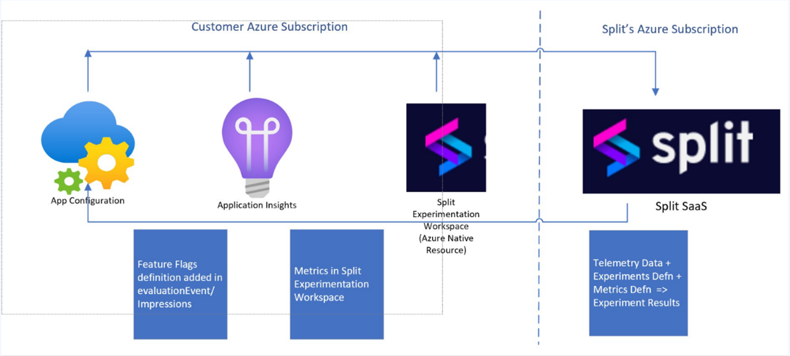

# Welcome to the Private Preview of experimentation in Azure App Configuration!

Split Experimentation for Azure App Configuration allows developers to easily test different variants of a feature and monitor the impact at the feature-level. Once configured, users will be able to analyze each individual feature, compare different variants, and quickly learn if product changes are making things better or worse. With this, development teams gain quantifiable insights that enable faster, safer product releases. This experience is powered by the combined use of Azure App Configuration, Application Insights and Split Experimentation Workspace. To get started on your first experiment on Azure, follow the steps outlined in this documentation.

## Experimentation in Azure App Configuration
 
To help introduce [experimentation](https://github.com/Muksvso/ExperimentationPreviewDocs?tab=readme-ov-file#what-is-experimentation) into your existing Azure resources, this new feature is an integrated offering by Split built on top of App Config and App Insights. As you go through this tutorial for setting up your first experiment, the key steps include setting up your App Config store including Variant Feature Flags, connecting your application to App Insights for definition of event data and metric mapping to be used for your experiment, and creating a Split Experimentation Workspace resource that will generate results powered by the Split SaaS on Azure.

### Getting Started

To use the Azure Portal to set up your first experiment, refer to the document [how to set up experimentation in Azure App Configuration](/how-to-setup-experimentation.md) which will allow you to create an experiment, setup metrics for results, create a QuickStart application to run the experiment on, and setup data access policies. To use CLI or ARM Template instead, refer to the document [ARM Template Instructions](/ARMTemplateInstructions.md).

---

### What is experimentation?
Microsoft has partnered with Split Software to deliver experimentation as a feature in Azure App Configuration. Experimentation gives teams a more efficient way to release changes that reduce the severity and duration of incidents and supports app development teams to maximize positive impact. 

If this is your first time running an experiment, here are some terms to familiarize yourself with beforehand in the context of using Feature Flags in App Configuration: 
- **Feature Flags:** Allow teams to **toggle features on or off** dynamically during runtime. The feature flag also has an associated code block. The feature flag's state triggers whether the code block runs. Read more about [Feature Flags on Azure App Configuration](https://learn.microsoft.com/en-us/azure/azure-app-configuration/concept-feature-management#basic-concepts).  
- **Variant Feature Flags:** Represent different versions or configurations of a feature. In an experiment, the variant feature flags are compared in relevance to the metrics you are interested in and the traffic you have allocated for the application audience. Read more about [Variant Feature Flags on Azure App Configuration](https://github.com/microsoft/FeatureManagement-Dotnet/tree/release/v4?tab=readme-ov-file#variants). 
- **A/B Testing:** A/B testing, also known as split testing, is an industry-standard method for evaluating the impact of potential changes within a technology stack. Read more about [A/B Testing on Products](https://www.microsoft.com/en-us/research/group/experimentation-platform-exp/articles/a-b-testing-across-products/).

Consider the following example: you want to see if customers of your e-commerce website are more likely to click the checkout button on their shopping cart if it is yellow in color (variant A) or when the same checkout button is orange in color (variant B). To setup this comparison, you are likely to divide traffic by half to each variant of the feature flag and use number of clicks as a metric to measure which one is performing better (where better is defined by an increase in number of clicks on the checkout button). It is unlikely that all your features will be as simple to measure and immediately evaluate, and that is where experimentation comes in. Running an experiment involves setting up a timeline for this process of comparing the performance of each variant relevant to the metrics you are interested in. The terms ‘A/B testing’ and ‘experimentation’ are often used interchangeably, where experimentation is essentially an extended A/B test where you are systematically testing hypotheses. 

**Experimentation**: The process of systematically testing hypotheses or changes to improve user experience or software functionality. This definition also holds true for most scientific fields including technology, where all experiments have 4 common steps: 

**1.	Developing a hypothesis** to document the purpose of this experiment,   
**2.	Outlining a method** of carrying out the experiment including setup, what will be measured and how,   
**3.	Observation** of the results measured by the metrics defined in the previous step,   
**4.	Drawing a conclusion** regarding whether the hypothesis was validated or invalidated.  

All A/B tests are experiments, but not all experiments are A/B tests, essentially implying that in the digital world, an A/B test is the simplest form of an experiment. Experimentation encompasses various controlled tests, including A/B testing, and can include more types of tests such as multivariate tests that include in-depth statistical analysis and more complex combinations of variant feature flags. 

In this tutorial, you will be generating a quote of the day to different users and observing their likes. The hypothesis is that users are more likely to click on the heart/like icon if the quote of the day is accompanied by a special message (“*hope this makes your day*”). Therefore, the metric to watch isnumber of clicks on the heart icon (or Likes) and comparing between the two variants. One variant is where the user sees the special message and the other where the user does not. In this scenario, the two variations of the feature are true and false. This makes our experiment an A/B test. However, if we were testing multiple combinations of multiple variants such as adding multiple like buttons or changing colors of the special message as well, then it would be a Multivariate test. It is important for you to identify what your experimentation goals are so that the results can help you improve your application be it for performance or business. 

### Setting goals for your experiment
Before starting, consider the following in your hypothesis discovery stage: 
What problem are you trying to solve by running an experiment? What should you run an experiment on? Why? Where do you even start? What are some strategies to follow according to your business needs? Will this experiment help you make immediate improvements to the performance of your application or to your business?

Now that you have identified what you hope to achieve by running an experiment prior to a full release, you have to document your plan. What are some metrics you are interested in? What events of user or system interaction will you use to capture data to fuel these metrics for measure? The tutorial here provides an example of translating a plan into action. As your experimentation plan: your goal at this stage is to make sure you are setting up your application code and resources to capture the correct data you are interested in.

When your experiment begins, you should quickly validate your configuration. Your goal at this stage is to make sure the data captured in all the resources you’ve deployed on Azure are passing validations: that you are indeed receiving the data that you had set up your resources to. If there are discrepancies, this is where you can check and edit your variant feature flags and instrumentation to resolve any issues with the assignment and data flow.

**Drawing a conclusion** (or multiple conclusions if needed) is the final stage of your experimentation cycle. These are learnings and outcomes that you can immediately implement into production go here. However, experimentation is a continuous process. Begin new experiments to continuously improve your product. 

### Experimentation metrics setup and interpretation
Your experiment is only as good as the data your App Insights resource has collected. Before you start the experiment, you must determine which variant you intend to use as the control (baseline variant) and which one you intend to see changes in (comparison variant). Once there is enough traffic to your application and subsequently more data from user interactions with events you have set up under the metrics mapping, you will start seeing results on the App Config Portal.

**Understand your experimentation results**

- **Desired Outcome:** The desired outcome refers to the specific result or effect we hope to achieve through an experiment or intervention. It represents success according to our goals.  
- **Undesired Outcome:** An undesired outcome is the opposite of what we want to achieve. It represents failure or an unexpected result.  
- **Inconclusive:** An inconclusive result occurs when the data collected from an experiment does not provide clear evidence for either the desired or undesired outcome. It means that we can not confidently conclude whether the intervention had a significant impact. Inconclusive results might arise due to insufficient sample size, noisy data, or other factors. Remember that experimentation involves analyzing data objectively and drawing meaningful conclusions based on evidence. Desired outcomes drive our efforts, undesired outcomes guide improvements, and inconclusive results prompt further investigation. All results can help drive data-informed decisons. 

