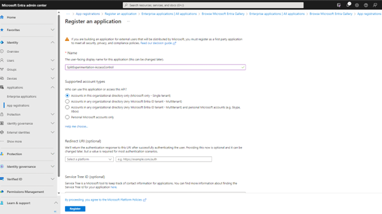
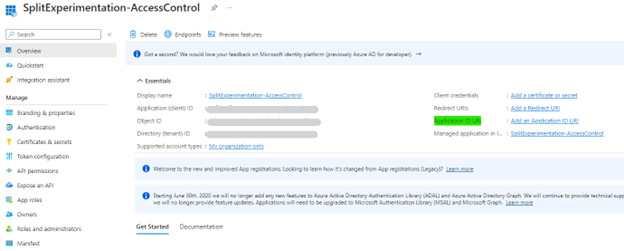
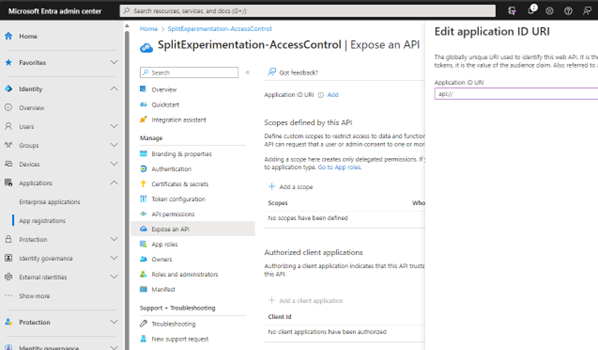
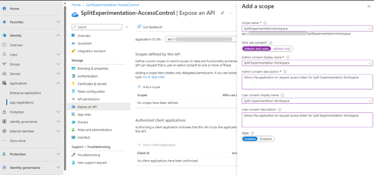
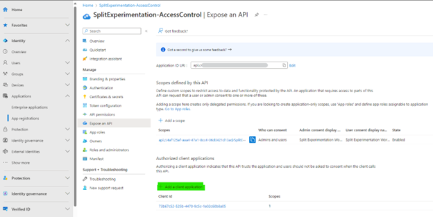
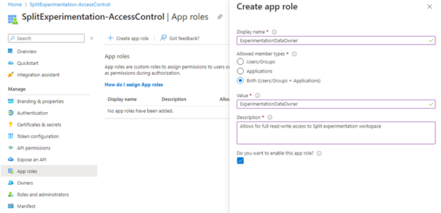
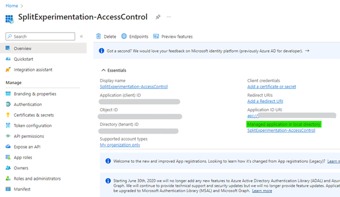
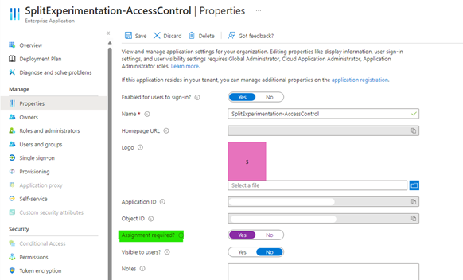
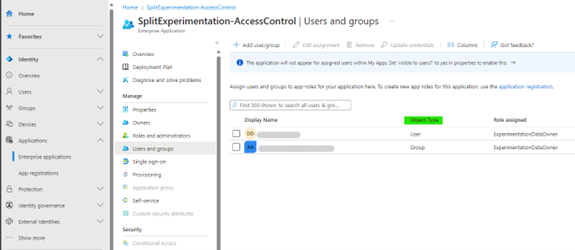

# How to set up Split Experimentation Workspace on Azure App Config Data Plane Access Control - authentication and authorization

Azure Split-Experimentation uses Microsoft Entra to authorize requests for Split Experimentation instances (Experimentation Workspaces). Microsoft Entra also enables the use of custom roles to grant permissions to security principals.

## Overview

All requests made to Split Experimentation Workspace must be authorized. To set up an access control policy, create new or use existing Microsoft Entra Application registration. That application and registration provides the authentication policy, security principles, define roles, etc. for allowing access to Split Experimentation Workspace (data plane). 

Optionally, a single Microsoft Entra Enterprise Application may be used to control access to multiple Split Experimentation workspaces.

To set up the Access Control policy for Split Experimentation Workspace (aka associate Microsoft Entra application), control plane operation is needed. Split only requires the application ID to set up the access policy. The said Entra application is owned and fully controlled by the customer. The application must be in the same Microsoft Entra Tenant, in which the Split Experimentation Workspace resource is provisioned or considered to be provisioned.

**With Microsoft Entra, access to a resource is set up in a two-step process:**

1.	The security principal's identity is authenticated, and an OAuth 2.0 token is issued. The resource name to request a token is https://login.microsoftonline.com/{tenantID} where {tenantID} matches the Microsoft Entra tenant ID to which the service principal belongs, ensure the scope is api://{Entra application ID}/.default where {Entra application ID} matches the application ID linked as access policy to the Split Experimentation Workspace resource.

2.	The token is passed as part of a request to the App Configuration service to authorize access to the specified resource.
 
## Setup Microsoft Entra Enterprise Application

### Register new or use existing Microsoft Entra Application Registration

The application must be in the same Microsoft Entra Tenant, in which the Split 	Experimentation Workspace is provisioned or considered to be provisioned. Only basic registration is needed at this point. Read more on this topic.

### Enable Entra application to be used as audience

Configure Application ID URI. This setting is mandatory to allow the Entra application to be used as global audience/scope when requesting an authentication token.

 
Ensure the value is: **api://{Entra application ID}** where {Entra application ID} must be the same Microsoft Entra application ID. 

### Allow users to request access to Split Experimentation from Azure Portal

Azure Portal UI is effectively the UX for Split Experimentation Workspace. It interacts with Split Experimentation data plane to set up Metrics, Create/Update/Archive/Delete experiments, Get experiment results, etc. Pre-authorizing Azure Portal Split UI is necessary to achieve that. 

**Add scope**

 
**Authorize Portal Access**

Ensure the following client application IDs are added.
Split Experimentation Resource Provider: d3e90440-4ec9-4e8b-878b-c89e889e9fbc
Split Experimentation Portal: 73b67c52-525b-4470-9c5c-1e02c60b8a05
Azure App Configuration Portal: 1e2401ea-428f-4575-9bbf-b301f7e1eb67

 
**Authorization roles**

Split Experimentation workspace supports well-known roles to scope access control. Add these roles in the Entra application first. 
The following values for roles are supported:
**ExperimentationDataOwner**  - read-write access to Experimentation Workspace
**ExperimentationDataReader**  - read-only access to Experimentation Workspace

 
### Configure user and role assignments

**Visit the associated Microsoft Entra Enterprise Application**

 
**Assignment requirements options**

**Yes** – only the entries, explicitly defined under “Users and Groups” in the Enterprise Application can obtain token and therefore access the associated Split Experimentation Workspace (recommended).

**No** – everyone in the same Entra tenant can obtain tokens and therefore may be allowed (via Split Control Plane opt-in setting) to access the associated Split Experimentation Workspace.
 
**Assign users and groups**

This associates existing security principals with Split Experimentation role(s), previously defined in 	the Entra application app roles section.

